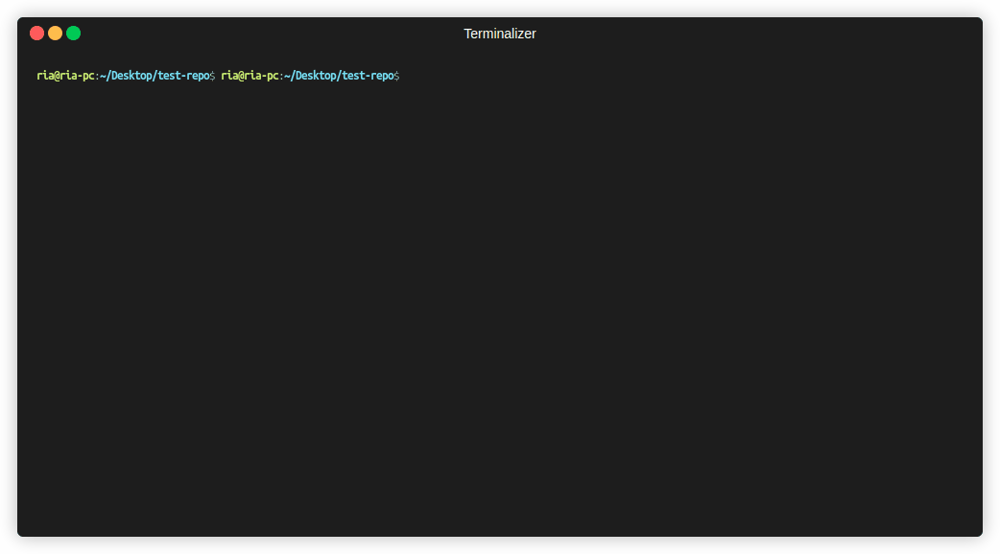

# 🔭 Tooldex
> Unified MCP Server Observatory — autodiscover, inspect, and monitor Model Context Protocol tools across Claude Code, Cursor, Codex, VSCode, Copilot, Gemini, Agents, and Docker

[](https://pypi.org/project/tooldex/)
[](https://pypistats.org/packages/tooldex)
[](https://opensource.org/licenses/MIT)
[](https://www.python.org/)

**Questions, feedback, or just want to say hi?** → [Contact the Dev](#contact-the-dev) · [banerjeeria2406@gmail.com](mailto:banerjeeria2406@gmail.com)

Tooldex autodiscovers MCP servers configured across your AI clients — Claude Code, Cursor, Codex, VSCode, Copilot, Gemini (Antigravity), Agents, Docker MCP Toolkit — and surfaces every exposed tool in a unified UI with a live REST API. No manual config. Run it from any project directory and it finds everything.

> ⚠️ **Tool Poisoning Attacks are real.** A malicious MCP server can expose dozens of legitimate tools and hide one bad one. Tooldex gives you full visibility into your MCP tool surface before anything executes — essential for any agentic AI environment.



---

## Why Tooldex?

As your agentic AI setup grows across distributed systems and multiple clients, you lose track of what MCP servers are running and what tools they expose. Tooldex fixes that:

- 🔍 **Autodiscovery** — finds every MCP server across all your AI clients
- 🛠️ **Tool Inspector** — probes each server live and lists every tool it exposes
- 🖥️ **Unified UI** — single dashboard across all your environments
- ⚡ **REST API** — query your MCP tool surface programmatically
- 🔒 **Security visibility** — spot tool poisoning attempts before they run

---
---

## Contents

- [Requirements](#requirements)
- [Installation](#installation)
- [Quick start](#quick-start)
- [How discovery works](#how-discovery-works)
- [Config file locations](#config-file-locations)
- [MCP config format](#mcp-config-format)
- [CLI reference](#cli-reference)
- [JSON output](#json-output)
- [Security scanning](#security-scanning)
- [API endpoints](#api-endpoints)
- [Testing](#testing)
- [Contributing](#contributing)
- [Contact the Dev](#contact-the-dev)

---

## Requirements

- Python 3.12 or later
- At least one supported MCP client configured (Claude Code, Cursor, Codex, VSCode, Copilot, Gemini, or Docker MCP Toolkit)

---

## Installation

```bash
pip install tooldex
```

Verify:

```bash
tooldex --version
```

---

## Quick start

```bash
cd your-project
tooldex run
```

Tooldex scans config files, probes each discovered server for its tool surface, and opens the UI. The startup banner shows where to connect:

```
  ╔══════════════════════════════════════════════════╗
  ║         tooldex  v1.0.1                         ║
  ╠══════════════════════════════════════════════════╣
  ║  Servers  12                                     ║
  ║  Tools    187                                    ║
  ╠══════════════════════════════════════════════════╣
  ║  →  http://127.0.0.1:8282                        ║
  ╚══════════════════════════════════════════════════╝
```

To see the discovery summary without starting the server:

```bash
tooldex run --no-serve
```

---

## How discovery works

When you run `tooldex run`, the following happens in order:

1. **Config scan** — Tooldex reads every known MCP config location for the current directory (see [Config file locations](#config-file-locations)). Each found server gets a qualified ID in the form `{client}:{server_name}` so servers from different clients never collide.

2. **Live probe** — Each discovered server is contacted concurrently. Tooldex calls `tools/list` on it and records which tools it exposes, how long it took, and any errors.

3. **Deduplication** — If the same server name appears in multiple clients (e.g., `browserbase` in both Claude Code and Cursor), both are retained as separate entries under their respective clients. Duplicate server names across clients are reported in the `duplicates` field.

4. **UI** — A local web server starts and serves the unified view.

---

## Config file locations

Tooldex checks all of the following on every run. Files that do not exist are skipped silently.

### Claude Code

| Scope | Path |
|---|---|
| Global | `~/.claude.json` |
| Project | `<project>/.claude/mcp.json` |
| Project (flat) | `<project>/.claude.json` |

### Cursor

| Scope | Path |
|---|---|
| Global | `~/.cursor/mcp.json` |
| Project | `<project>/.cursor/mcp.json` |

### Codex CLI

| Scope | Path |
|---|---|
| Global | `~/.codex/config.toml` |
| Project | `<project>/.codex/config.toml` |

### VSCode

| Scope | Path |
|---|---|
| Workspace | `<project>/.vscode/mcp.json` |
| Workspace | `<project>/.vscode/.mcp.json` |
| User (global) | `~/.config/Code/User/mcp.json` |

VSCode nests servers under a top-level `"servers"` key rather than `"mcpServers"` — Tooldex parses that shape natively, no config changes needed on your end. `${input:...}` placeholders (VSCode's prompted-variable syntax) are left untouched since Tooldex doesn't drive VSCode's input UI; standard `${VAR}` / `$VAR` env references still resolve normally. All three paths are scanned independently — if more than one exists, servers from each are merged in.

### Copilot CLI

| Scope | Path |
|---|---|
| Global | `~/.copilot/mcp-config.json` |

GitHub Copilot CLI's own config — separate from VSCode's Copilot chat extension above. Unlike VSCode, it uses the standard `"mcpServers"` key (same shape as Claude/Cursor), with a `"type": "local"` transport field and an optional `"tools"` allowlist array that Tooldex doesn't currently filter on — all of a server's discovered tools are shown regardless of what's listed there.

### MCP JSON (shared / team configs)

| Scope | Path |
|---|---|
| Global | `~/.mcp.json` |
| Project | `<project>/.mcp.json` |
| Project (bare) | `<project>/mcp.json` |

### Agents

| Scope | Path |
|---|---|
| Global | `~/.agents/mcp.json` |
| Global | `~/.agents/.mcp.json` |
| Project | `<project>/.agents/mcp.json` |
| Project | `<project>/.agents/.mcp.json` |

### Gemini (Antigravity IDE)

| Scope | Path |
|---|---|
| Global | `~/.gemini/antigravity/mcp_config.json` |

### Docker MCP Toolkit

Tooldex reads all Docker MCP profiles via `docker mcp profile ls`. No additional configuration is needed.

**Project-scoped paths** are discovered by walking up the directory tree from `cwd` until the home directory. This means running `tooldex run` from a nested subdirectory will still find config files at the project root. Both `mcp.json` and `.mcp.json` are checked at every level of the walk.

---

## MCP config format

All JSON-based clients use the same `mcpServers` structure. Tooldex understands both `stdio` (command-based) and `http`/`sse` (URL-based) transports.

**Comments are supported.** Tooldex parses JSON5, so `//` line comments and `/* block */` comments in config files are handled gracefully — no need to strip them before running.

### stdio server (runs a local process)

```json
{
  "mcpServers": {
    "filesystem": {
      "command": "npx",
      "args": ["-y", "@modelcontextprotocol/server-filesystem", "/home/user"],
      "env": {
        "SOME_VAR": "value"
      }
    },
    "my-db-server": {
      "command": "node",
      "args": ["/path/to/my-server/index.js"],
      "env": {
        "DB_HOST": "localhost",
        "DB_PORT": "5432"
      }
    }
  }
}
```

### HTTP / SSE server (connects to a remote endpoint)

```json
{
  "mcpServers": {
    "browserbase": {
      "type": "http",
      "url": "https://mcp.browserbase.com/mcp"
    },
    "remote-api": {
      "type": "sse",
      "url": "https://api.example.com/mcp/sse"
    }
  }
}
```

### Codex (`~/.codex/config.toml`)

Codex uses TOML with an `[mcp_servers.<id>]` table per server:

```toml
[mcp_servers.filesystem]
command = "npx"
args = ["-y", "@modelcontextprotocol/server-filesystem", "."]

[mcp_servers.github]
type = "http"
url = "https://api.githubcopilot.com/mcp/"
```

### What Tooldex detects from these files

For each config file found, Tooldex reports:

- **`status`** — `found` / `not_found` / `empty` / `parse_error` / `read_error`
- **`server_ids`** — list of server names parsed from the file
- **`in_file_duplicates`** — server names that appeared more than once as JSON keys (the last value is kept; all prior definitions are silently dropped by the JSON parser)

For each server probed:

- **`status`** — `found` / `timeout` / `connection_failed` / `protocol_error` / `missing_command`
- **`tools`** — names, descriptions, and input schemas of every tool the server exposes
- **`duration_ms`** — probe wall time
- **`error`** — human-readable failure message when status is not `found`; includes install hints for common missing runtimes (`uvx`, `npx`, `docker`, etc.)

---

## CLI reference

```
tooldex [OPTIONS] COMMAND [ARGS]
```

### Global options

| Flag | Description |
|---|---|
| `--version`, `-V` | Print version and exit |
| `--help`, `-h` | Show help |

### `tooldex run`

Autodiscover MCP servers and start the UI.

```bash
tooldex run [OPTIONS]
```

| Flag | Default | Description |
|---|---|---|
| `--port`, `-p` | `8282` | Starting port. Increments automatically if occupied. |
| `--host` | `127.0.0.1` | Interface to bind the UI server to. |
| `--no-serve` | off | Print discovery summary and exit without starting the server. |
| `--json` | off | Print discovery result as JSON and exit. Implies `--no-serve`. Does not probe servers. |
| `--timeout` | `10.0` | Per-server probe timeout in seconds. |
| `--concurrency` | `8` | Maximum concurrent server probes. |
| `--no-probe <name>` | — | Skip probing a specific server by name. Repeatable. |
| `--config <path>` | — | Additional MCP config file to include. Repeatable. Custom configs are processed first and win on duplicate server IDs. |
| `--no-cache` | off | Bypass the probe cache and re-probe every server live. |
| `--no-security-scan` | off | Skip the automatic YARA security scan (see [Security scanning](#security-scanning)). Equivalent to `TOOLDEX_SECURITY_SCAN=false`, and also applies to later "rescan all" calls for the life of this server. |

All flags accept both `--flag` and `-flag` prefix.

#### Examples

```bash
# Discover and launch UI
tooldex run

# Custom port and host
tooldex run --port 9000 --host 0.0.0.0

# Just print what was found, don't start the server
tooldex run --no-serve

# Skip slow or broken servers during probing
tooldex run --no-probe node-api-docs --no-probe local-mcp

# Include an extra config file
tooldex run --config ~/shared/team-servers.json

# Increase timeout for slow servers
tooldex run --timeout 30

# Use all 16 cores for probing
tooldex run --concurrency 16

# Pipe the discovery result into jq
tooldex run --json | jq '.duplicates'

# Force a live re-probe of every server, ignoring the probe cache
tooldex run --no-cache

# Skip the automatic YARA security scan entirely
tooldex run --no-security-scan
```

---

## JSON output

`tooldex run --json` prints a single JSON object to stdout and exits. No servers are probed; this is fast and side-effect-free for use in scripts and CI.

```json
{
  "sources": [
    {
      "client": "claude_code_user",
      "path": "/home/user/.claude.json",
      "status": "found",
      "error": null,
      "server_ids": ["filesystem", "github"],
      "in_file_duplicates": []
    },
    {
      "client": "mcp_json_user",
      "path": "/home/user/.mcp.json",
      "status": "not_found",
      "error": null,
      "server_ids": [],
      "in_file_duplicates": []
    }
  ],
  "servers": {
    "claude_code_user:filesystem": {
      "name": "filesystem",
      "transport": "stdio",
      "command": "npx",
      "args": ["-y", "@modelcontextprotocol/server-filesystem", "/home/user"],
      "url": null
    }
  },
  "duplicates": [
    "\"filesystem\" in cursor_user is also configured in claude_code_user",
    "\"firecrawl-mcp\" is a duplicate key in /home/user/.mcp.json (last value kept)"
  ]
}
```

**Fields:**

| Field | Description |
|---|---|
| `sources` | Every config location checked, with status and server IDs found. |
| `servers` | Deduplicated map of all servers, keyed by `{client}:{server_id}`. |
| `duplicates` | Human-readable notes about server name collisions across clients, and duplicate JSON keys within a single file. |

**Exit codes:** `0` on success, `1` on serialisation error.

---

## Security scanning

Powered by [Cisco's MCP Scanner](https://github.com/cisco-ai-defense/mcp-scanner) (`mcpscanner` on PyPI) — Tooldex wraps it, it doesn't reimplement it.

### YARA scan (always on)

Runs automatically as part of every discovery and rescan, for every server. Local, free, no API key required, no configuration needed.

**Every server is connected to twice per discovery/rescan** — once by Tooldex's own discovery probe (to call `tools/list` and populate the UI), and once independently by mcpscanner's `Scanner` (to fetch tool metadata for YARA analysis). These are two separate connections/process launches; mcpscanner doesn't expose a way to reuse tools Tooldex has already fetched. If the same server name is configured in multiple clients (e.g. both VSCode and Copilot CLI), each client's copy is scanned separately, so you may see more than 2 connections total for that server name.

| Env var | Description | Default |
|---|---|---|
| `TOOLDEX_SECURITY_SCAN` | Set to `false` to disable the automatic YARA scan entirely (both at startup and on later "rescan all" calls). Same as passing `--no-security-scan`. | `true` |
| `MCP_SCANNER_CONCURRENCY` | Maximum concurrent YARA scan calls. Distinct from `run`'s `--concurrency` flag, which controls tool-*probing* concurrency, not scanning. | `8` |

`--no-security-scan` and `TOOLDEX_SECURITY_SCAN=false` are equivalent — either one disables the scan (the flag works by setting that env var for the process). Whenever the scan is skipped, Tooldex prints the reason to the CLI:

```
Security scan skipped — --no-security-scan flag was passed.
Security scan skipped — TOOLDEX_SECURITY_SCAN is set to false.
```

### AI security scan (LLM-as-judge, opt-in)

Tooldex's AI security scan is powered by Cisco AI Defense's open-source mcpscanner SDK, running entirely locally — the only network call it makes is to whichever LLM provider you configure.

An LLM reviews each tool's name, description, and input schema for malicious intent (data exfiltration, prompt injection, tool poisoning, etc.). Unlike YARA, this never runs automatically — it's triggered manually per server, from the UI ("AI security scan" button) or via `POST /api/servers/{id}/llm-scan/`.

Requires `TOOLDEX_LLM_API_KEY` at minimum. Without it, the AI security scan is simply unavailable — YARA scanning is unaffected.

| Env var | Legacy fallback | Description | Default |
|---|---|---|---|
| `TOOLDEX_LLM_API_KEY` | `MCP_SCANNER_LLM_API_KEY` | API key for your LLM provider (OpenAI, Anthropic, etc). Required to enable the AI security scan. | *(unset — scan disabled)* |
| `TOOLDEX_LLM_MODEL` | `MCP_SCANNER_LLM_MODEL` | Model to use, e.g. `gpt-4o`, `claude-3-5-sonnet-latest` | `gpt-4o` |
| `TOOLDEX_LLM_RATE_LIMIT_DELAY` | `MCP_SCANNER_LLM_RATE_LIMIT_DELAY` | Seconds to wait between LLM calls | `2.0` |
| `TOOLDEX_LLM_TEMPERATURE` | `MCP_SCANNER_LLM_TEMPERATURE` | Sampling temperature | `1.0` |
| `TOOLDEX_LLM_MAX_RETRIES` | `MCP_SCANNER_LLM_MAX_RETRIES` | Max retries on a failed LLM call | `6` |
| `TOOLDEX_LLM_BASE_URL` | `MCP_SCANNER_LLM_BASE_URL` | Custom endpoint (Azure OpenAI, self-hosted Ollama/vLLM/LocalAI, etc.) | *(unset)* |
| `TOOLDEX_LLM_API_VERSION` | `MCP_SCANNER_LLM_API_VERSION` | API version, e.g. required by Azure OpenAI | *(unset)* |
| `TOOLDEX_LLM_TIMEOUT` | `MCP_SCANNER_LLM_TIMEOUT` | Per-request LLM timeout in seconds | `30` |

Every `TOOLDEX_LLM_*` var also accepts its original mcpscanner name (`MCP_SCANNER_LLM_*`) as a fallback if the `TOOLDEX_LLM_*` one isn't set — an existing mcpscanner-native setup keeps working un-migrated. Using a legacy name prints a one-time notice on the CLI pointing at the rename.

`MCP_SCANNER_API_KEY` (Cisco's separate cloud API) and `VIRUSTOTAL_API_KEY` are **not** supported — Tooldex only uses mcpscanner's local YARA and LLM analyzers.

**Model support:** any [LiteLLM](https://docs.litellm.ai/)-compatible model string works, since the LLM analyzer runs through LiteLLM internally — there's no fixed allowlist. `TOOLDEX_LLM_MODEL` defaults to `gpt-4o` if unset.

**Caching:** results are cached per-server, per-tool at `~/.tooldex/llm_scan_cache.json`, fingerprinted by a hash of each tool's name, description, and input schema — a cache entry is invalidated automatically the moment that tool's identity changes, with no TTL otherwise.

- Clicking "AI security scan" (or its rerun icon) always forces a fresh LLM call per tool, bypassing any cache hit — but still writes the result back to the cache.
- On `tooldex run` startup, and on every page load, the last cached verdict for each server is shown immediately with zero LLM calls made.
- The clear-cache (trash) icon removes all cached entries for a server and resets its displayed state back to "not yet scanned."
- Rescanning a server (or "Rescan All") while an AI security scan is in flight on it is blocked with `409 llm_scan_running` unless forced, in which case the running scan is aborted first.

---

## API endpoints

When the server is running (default `http://127.0.0.1:8282`):

All endpoints respond with or without a trailing slash.

| Method | Endpoint | Description |
|---|---|---|
| `GET` | `/api/health/` | `status`, current `timestamp`, and `uptime_seconds` since the server started |
| `GET` | `/api/servers/` | All MCP servers with `total_servers`, `total_tools`, `scanned_at`. Per server: `tool_count`, `source_file`, `has_llm_cache`, and the `security_*` fields below |
| `GET` | `/api/servers/{id}/` | Single server with full tool detail |
| `POST` | `/api/servers/{id}/rescan/` | Re-probe a single server, update its tools in place, and (if the probe succeeds and `TOOLDEX_SECURITY_SCAN` isn't disabled) re-run its YARA scan too, so `security_scanned`/`security_risk` stay current. `force=true` aborts an in-flight AI security scan on this server first; otherwise returns `409 {"error": "llm_scan_running"}` while one is running |
| `POST` | `/api/servers/{id}/llm-scan/` | Start the AI security scan for one server as a background job. `force` (default `true`) skips the cache and forces fresh LLM calls; results are cached either way |
| `GET` | `/api/servers/{id}/llm-scan/status/` | Poll progress (`scanned`/`total`) and outcome of the AI security scan job for this server |
| `POST` | `/api/servers/{id}/llm-scan/stop/` | Signal a running AI security scan to stop |
| `POST` | `/api/servers/{id}/llm-scan/invalidate-cache/` | Clear cached AI scan results for this server and reset its displayed state to "not yet scanned" |
| `GET` | `/api/files/` | All config files that were scanned: path, client, status, server IDs found, any parse errors |
| `POST` | `/api/rescan/` | Full rediscovery — re-reads all MCP configs and re-probes every server. Returns `{"status": "already_scanning"}` if a rescan is already in progress. |
| `GET` | `/api/rescan/stream/` | Same rediscovery as above, streamed as Server-Sent Events (one per server, then `done`). `force=true` aborts any in-flight AI security scans fleet-wide first; otherwise yields `{"type": "blocked", "servers": [...]}` and stops |

**Per-server security fields** (on `/api/servers/` and `/api/servers/{id}/`):

| Field | Description |
|---|---|
| `security_findings` | List of findings from the last scan: `{tool_name, severity, analyzer, threat_category, summary}` |
| `security_risk` | Worst severity across all findings — `HIGH` / `MEDIUM` / `LOW` / `INFO` / `null` |
| `security_scanned` | `true` once this server has been included in a scan run |
| `security_llm_scanned_at` | UTC ISO timestamp of the last AI security scan, if any |
| `security_llm_new_findings` | Findings from the last AI scan not present in the one before it |
| `security_llm_cache_hits` | Of the last AI scan's tools, how many were served from cache rather than a real LLM call |
| `security_llm_last_scan_total` | Total tools attempted in the last AI scan (cache hits + real calls) |
| `has_llm_cache` | Whether any cached AI scan result exists for this server (drives the clear-cache icon) |

---

## Testing

Tooldex has a `pytest` unit-test suite that runs in CI on every PR:

```bash
pip install -e ".[test]"
pytest
```

See [CONTRIBUTING.md](CONTRIBUTING.md#testing) for details. For ad-hoc manual checks against your own MCP config:

```bash
# Verify discovery against your local config
tooldex run --no-serve

# Inspect the raw discovery payload
tooldex run --json | jq .

# Check a specific extra config file
tooldex run --config ./my-config.json --json

# Confirm a server is reachable with a longer timeout
tooldex run --timeout 30 --no-probe github
```

To run the package from source without installing:

```bash
git clone <repo>
cd Tooldex
pip install -e .
tooldex --version
```

---

## Contributing

Contributions are welcome. See [CONTRIBUTING.md](CONTRIBUTING.md) for setup instructions, the development workflow, and pull request guidelines.

---

## Contact the Dev

Have a bug report, feature request, or just want to share feedback? Reach out directly:

**Email:** [banerjeeria2406@gmail.com](mailto:banerjeeria2406@gmail.com)

All feedback is welcome — whether it's a quick note or a detailed suggestion.
